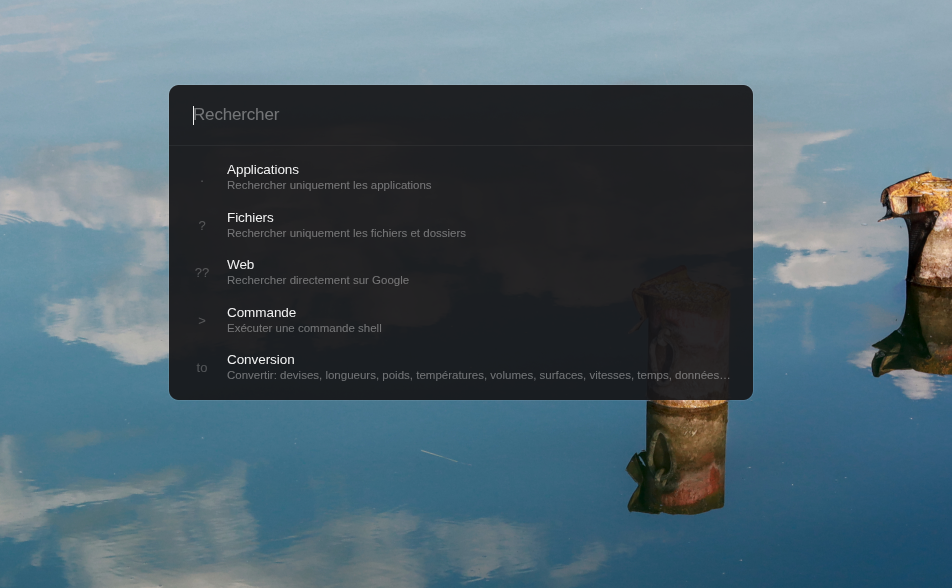

# Finder - Application Launcher for Linux

<p align="center">
  
  
  
  
</p>

Une application de recherche type **Spotlight** pour Linux, construite avec Electron. Finder permet de rechercher et lancer rapidement des applications, fichiers, et effectuer des calculs, le tout avec un simple raccourci clavier.

## 📸 Preview

<p align="center">
  
</p>

## ✨ Fonctionnalités

### 🚀 Recherche d'applications
- Recherche instantanée dans toutes les applications installées
- Support des applications système, Snap et Flatpak
- Icônes natives des applications

### 📁 Recherche de fichiers
- Indexation du répertoire HOME (profondeur: 4 niveaux)
- Icônes personnalisées par type de fichier
- Preview des images directement dans les résultats
- Support de plus de 40 types de fichiers

### 🧮 Calculatrice intégrée
- Détection automatique des expressions mathématiques
- Support des opérations: `+`, `-`, `*`, `/`, `%`, `^` (puissance)
- Support des parenthèses pour l'ordre des opérations
- Copie automatique du résultat dans le presse-papier

### 🌐 Recherche Google
- Fallback automatique vers Google si aucun résultat local
- Ouverture dans le navigateur par défaut

### 🔎 Snippets de recherche avancée
- **`.`** : Rechercher uniquement les applications (ex: `.firefox`)
- **`?`** : Rechercher uniquement les fichiers et dossiers (ex: `?document`)
- **`??`** : Recherche directe sur Google (ex: `??recette de crêpes`)
- **`>`** : Exécuter une commande shell (ex: `>ls -la`)
- **`to`** : Conversions d'unités et devises (ex: `10$ to eur`, `100m to ft`)

### 📜 Historique des recherches
- Stockage persistant des 5 dernières recherches
- Clic pour relancer directement l'application/fichier
- Suppression individuelle des entrées

### ⚡ Autres fonctionnalités
- **Auto-démarrage** : Se lance automatiquement au démarrage de la session
- **Mises à jour automatiques** : Télécharge chaque release publiée depuis `main`
  et propose un redémarrage dès qu'elle est prête
- Interface moderne et fluide
- Masquage automatique de la fenêtre (blur)
- Compteur d'éléments indexés

## 📦 Installation

### Installation rapide (utilisateurs)

**Pour Ubuntu/Debian :**

1. **Télécharger le fichier `.deb`** depuis les [releases](https://github.com/slayercode1/Utilitaire-Ubuntu/releases)

   Vérifiez ensuite le checksum et sa signature Sigstore :

```bash
sha256sum --check SHA256SUMS
cosign verify-blob \
  --bundle SHA256SUMS.sigstore.json \
  --certificate-identity 'https://github.com/slayercode1/Utilitaire-Ubuntu/.github/workflows/release.yml@refs/heads/main' \
  --certificate-oidc-issuer https://token.actions.githubusercontent.com \
  SHA256SUMS
gh attestation verify Finder-*-amd64.deb --repo slayercode1/Utilitaire-Ubuntu
```

2. **Installer le package** :
```bash
sudo apt install ./Finder-*-amd64.deb
```

3. **C'est tout !** 🎉
   - L'application se lance automatiquement en arrière-plan
   - Appuyez sur **`Alt + Space`** pour l'utiliser
   - Finder vérifie les mises à jour au démarrage puis toutes les quatre heures

   Le paquet configure lui-même le sandbox Chromium (`chrome-sandbox` en
   root:4755 via le script post-installation) : **aucune manipulation n'est
   demandée aux utilisateurs**, y compris sur Ubuntu 24.04+ où le noyau
   restreint les user namespaces non privilégiés.

   > **Dépannage** — si une installation datant d'une version antérieure
   > affiche « The SUID sandbox helper binary was found, but is not
   > configured correctly », réinstallez le paquet ou exécutez :
   > `sudo chmod 4755 /opt/Finder/chrome-sandbox`

Les paquets AppImage et Debian téléchargent automatiquement la dernière release
GitHub, vérifient son empreinte SHA-512 et demandent avant de redémarrer. Une
installation Snap doit être mise à jour par le Snap Store.

> **AppImage sur Ubuntu 24.04+** : un AppImage ne peut pas embarquer de
> binaire setuid ; si le lancement échoue sur l'erreur de sandbox, préférez
> le `.deb`, ou autorisez les user namespaces pour ce binaire via un profil
> AppArmor (même principe que `scripts/setup-dev-sandbox.sh`).

**Désinstallation :**
```bash
sudo apt remove finder
```

---

### Installation pour développeurs

#### Prérequis
- Node.js 22.12 ou supérieur
- npm ou yarn
- Linux (Ubuntu, Debian, Fedora, Arch, etc.)

#### Étapes

1. **Cloner le dépôt**
```bash
git clone https://github.com/slayercode1/Utilitaire-Ubuntu.git
cd Utilitaire-Ubuntu
```

2. **Installer les dépendances**
```bash
npm install
```
   Ce `npm install` installe aussi les hooks git (husky) : formatage et lint
   Biome au commit, message au format Conventional Commits, typecheck + tests
   avant chaque push.

3. **Autoriser le sandbox Chromium** *(une fois par machine, Ubuntu 24.04+)*
```bash
sudo scripts/setup-dev-sandbox.sh
```
   Ubuntu restreint les user namespaces non privilégiés : sans ce réglage,
   `npm start` s'arrête sur « The SUID sandbox helper binary was found, but
   is not configured correctly ». Le script installe un profil AppArmor qui
   autorise les user namespaces **pour le seul binaire Electron de ce
   dépôt** — pas de `chmod 4755` sur un fichier de `node_modules` (un
   binaire setuid-root réécrit à chaque `npm install` serait une élévation
   de privilèges offerte à toute compromission de la chaîne npm), et le
   profil survit aux réinstallations. Les utilisateurs finaux ne sont pas
   concernés : le `.deb` règle son propre sandbox à l'installation.

4. **Lancer en mode développement**
```bash
npm start
```

#### Construction de l'application

Pour créer un package distribuable :

```bash
# Créer l'AppImage, le .deb et les métadonnées d'auto-update
npm run release:linux

# Les fichiers seront dans ./out/builder/
```

**Le package .deb inclut :**
- ✅ L'application Finder
- ✅ Configuration autostart (lancement automatique au démarrage)
- ✅ Fichier .desktop pour le menu d'applications
- ✅ Toutes les dépendances

**Note sur l'auto-démarrage :**
L'application se configure automatiquement pour démarrer avec votre session
Linux en créant elle-même une entrée atomique et privée dans
`~/.config/autostart/`. Aucune configuration manuelle n'est nécessaire.

## 🎮 Utilisation

### Raccourci clavier
Appuyez sur **`Alt + Space`** pour ouvrir/fermer Finder

En configuration multi-écrans, Finder s'ouvre sur l'écran où se trouve le
curseur, comme Spotlight sur macOS.

### Snippets de recherche

#### Applications uniquement (`.`)
```
.firefox     → Cherche uniquement dans les applications
.chrome
.code
```

#### Fichiers uniquement (`?`)
```
?document    → Cherche uniquement dans les fichiers/dossiers
?image
?projet
```

#### Recherche web (`??`)
```
??météo paris     → Recherche directement sur Google
??traduction bonjour en anglais
```

#### Commandes shell (`>`)
```
>ls -la           → Exécute la commande dans un terminal
>htop
>git status
```

#### Conversions (`to`)
```
# Devises
10$ to eur        → Convertit 10 dollars en euros
100€ to usd
50£ to eur

# Longueurs
100m to ft        → Convertit 100 mètres en pieds
5km to mi
10in to cm

# Poids
5kg to lb         → Convertit 5 kilos en livres
100g to oz

# Températures
20c to f          → Convertit 20°C en Fahrenheit
100f to c

# Volumes
5l to gal         → Convertit 5 litres en gallons
```

**Note :** Le résultat des conversions est automatiquement copié dans le presse-papier.

### Recherche
1. Tapez le nom d'une application, fichier, ou une expression mathématique
2. Utilisez les flèches **↑** et **↓** pour naviguer
3. Appuyez sur **Entrée** pour ouvrir/lancer
4. Appuyez sur **Échap** pour fermer

### Exemples

**Recherche d'applications :**
```
firefox
chrome
code
```

**Recherche de fichiers :**
```
document.pdf
photo.jpg
script.sh
```

**Calculs mathématiques :**
```
2+2           → 4
10*5          → 50
(5+3)*2       → 16
2^8           → 256
100/4         → 25
15%4          → 3
```

## 🏗️ Architecture du projet

Le projet est écrit intégralement en TypeScript. Les sources vivent dans `src/`
et sont compilées vers `dist/`, d'où Electron les charge.

Le compilateur utilise le mode `strict` et ses contrôles complémentaires. Le
build exécute aussi `scripts/check-strict-types.ts`, qui refuse les types
échappatoires explicites et les paramètres de capture non typables proprement.

```
finder/
├── src/
│   ├── main/                   # Processus principal
│   │   ├── index.ts            # Point d'entrée
│   │   ├── config.ts           # Constantes et chemins
│   │   ├── window.ts           # Fenêtre et positionnement multi-écrans
│   │   ├── lifecycle.ts        # Instance unique, démarrage automatique
│   │   ├── ipc/                # Handlers IPC (transport uniquement)
│   │   ├── services/           # Logique métier, sans Electron
│   │   └── scanners/           # Accès au système
│   ├── preload/index.ts        # Pont contextBridge
│   ├── renderer/               # Interface
│   │   ├── index.html
│   │   ├── main.ts
│   │   └── features/conversion/
│   └── shared/                 # Contrats IPC, types, chemins
├── tests/unit/                 # Tests unitaires Vitest
└── scripts/                    # Outillage de build
```

### Frontières

Le renderer n'a accès à aucune API Node : sa configuration TypeScript ne déclare
aucun type Node, ce qui rend un `import fs` impossible à compiler. Tous les
échanges passent par `window.electronAPI`, défini par le preload.

Le document principal utilise l'origine interne sécurisée
`finder-app://renderer`. Le handler ne sert que les fichiers compilés attendus ;
les images locales doivent appartenir à un index détenu par le processus main.

Les scanners et les services ne dépendent pas d'Electron : ils sont vérifiables
sans lancer l'application.

## ⚙️ Configuration

### Raccourci clavier et dimensions

Dans `src/main/config.ts` :
```typescript
export const GLOBAL_SHORTCUT = 'Alt+Space'
export const WINDOW_TOP_POSITION = 0.15   // 15 % depuis le haut
```

### Profondeur de scan des fichiers

Dans `src/main/scanners/file-scanner.ts` :
```typescript
const MAX_SCAN_DEPTH = 4
```

### Emplacements système

Dans `src/shared/paths.ts` : répertoires `.desktop`, thèmes d'icônes et racines
autorisées, partagés par tous les scanners.

## 🎨 Personnalisation

Les couleurs, espacements et durées d'animation sont regroupés en variables CSS
au début de `src/renderer/styles.css`.

## 🧪 Développement

```bash
npm start               # compile puis lance l'application
npm test                # tests unitaires (Vitest)
npm run test:e2e        # tests E2E Playwright (vraie application Electron)
npm run test:regression # parcours critique + comparaisons visuelles
npm run test:all        # unitaires + couverture + E2E + régression
npm run lint            # Biome (format + lint) ; lint:fix pour corriger
npm run typecheck       # vérification de types (mode strict)
npm run verify          # typecheck + tests + build
npm run make            # paquets .deb et .zip
```

La qualité est verrouillée par les hooks git (installés par `npm install`) :

| Hook         | Vérification                                              |
| ------------ | --------------------------------------------------------- |
| `pre-commit` | Biome sur les fichiers indexés (lint-staged)               |
| `commit-msg` | Message au format Conventional Commits (commitlint)        |
| `pre-push`   | `typecheck` + tests unitaires                              |

### Activer les DevTools

Dans `src/main/window.ts`, après la création de la fenêtre :
```typescript
win.webContents.openDevTools({ mode: 'detach' })
```

## 🔒 Confidentialité des données

Finder fonctionne **entièrement en local**. L'application ne comporte ni compte
utilisateur, ni serveur, ni télémétrie, ni collecteur de plantages, ni service
d'analyse d'usage. Aucune dépendance tierce de collecte n'est embarquée.

### Données conservées

| Donnée | Emplacement | Durée | Finalité |
|---|---|---|---|
| Historique de recherche (5 entrées) | Stockage local du navigateur | Jusqu'à effacement | Proposer les recherches récentes |
| Index des applications et fichiers | Mémoire vive uniquement | Durée de la session | Répondre aux recherches |
| Position du curseur | Non conservée | Instantanée | Ouvrir sur le bon écran |

L'index des fichiers ne quitte jamais la mémoire : il n'est écrit sur aucun
disque et disparaît à la fermeture.

### Seul flux sortant

La recherche web (préfixe `??`, ou absence de résultat local) ouvre votre
navigateur par défaut sur Google avec la requête saisie. **Elle n'est déclenchée
que par une action explicite.** L'URL est construite par le processus principal
à partir de la seule requête, jamais par l'interface.

Aucune autre donnée ne sort de votre poste.

### Effacer vos données

Appuyez sur **`Ctrl + Suppr`** dans la fenêtre de recherche. Après confirmation,
l'application supprime :

- l'historique de recherche ;
- les caches du moteur de rendu ;
- les artefacts créés par Chromium.

Vos fichiers personnels ne sont pas touchés.

Au démarrage, Finder retire par ailleurs les fichiers laissés par la session
précédente que Chromium crée sans finalité pour cette application, dont un
identifiant persistant du poste
(`Crashpad/client_id`).

### Journaux

Les messages affichés dans la console ne contiennent ni chemin de fichier, ni
requête, ni contenu de document. Ils ne sont écrits dans aucun fichier et ne
sont transmis nulle part.

## 🤝 Contribution

Les contributions sont les bienvenues ! Le guide complet (mise en route,
hooks, style, tests, sécurité) est dans [CONTRIBUTING.md](CONTRIBUTING.md).
En résumé :

1. Fork le projet
2. Créez votre branche (`git checkout -b feat/ma-fonctionnalite`)
3. Committez au format Conventional Commits (`git commit -m 'feat: ajoute ma fonctionnalité'`) — vérifié par le hook `commit-msg`
4. Push vers la branche (`git push origin feat/ma-fonctionnalite`) — typecheck + tests exécutés par le hook `pre-push`
5. Ouvrez une Pull Request

### Guidelines
- Style appliqué automatiquement par Biome (`npm run lint:fix`)
- Commentaires expliquant le *pourquoi*, en français
- Tout nouveau service arrive avec ses tests unitaires
- Tester sur différentes distributions Linux quand c'est possible

## 📝 Licence

Code **source disponible** : consultation, usage personnel et contributions bienvenus ; redistribution et usage commercial soumis à autorisation. Voir [LICENSE](LICENSE) et [CONTRIBUTING.md](CONTRIBUTING.md).

## 🙏 Remerciements

- Inspiré par Spotlight (macOS)
- Construit avec [Electron](https://www.electronjs.org/)
- Icônes générées avec SVG

## 📧 Contact

Pour toute question ou suggestion :
- Ouvrir une issue sur GitHub
- Contribuer via Pull Request
- Pour une vulnérabilité, suivre la procédure privée de [SECURITY.md](SECURITY.md)

---

**Fait avec ❤️ pour la communauté Linux**
